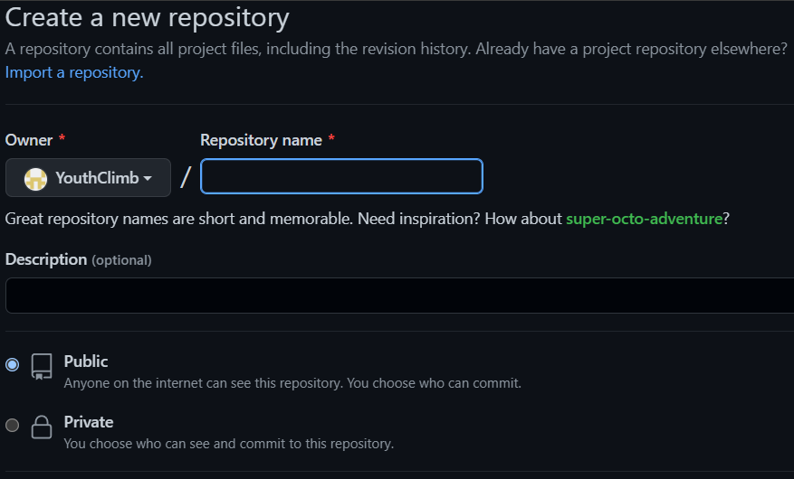
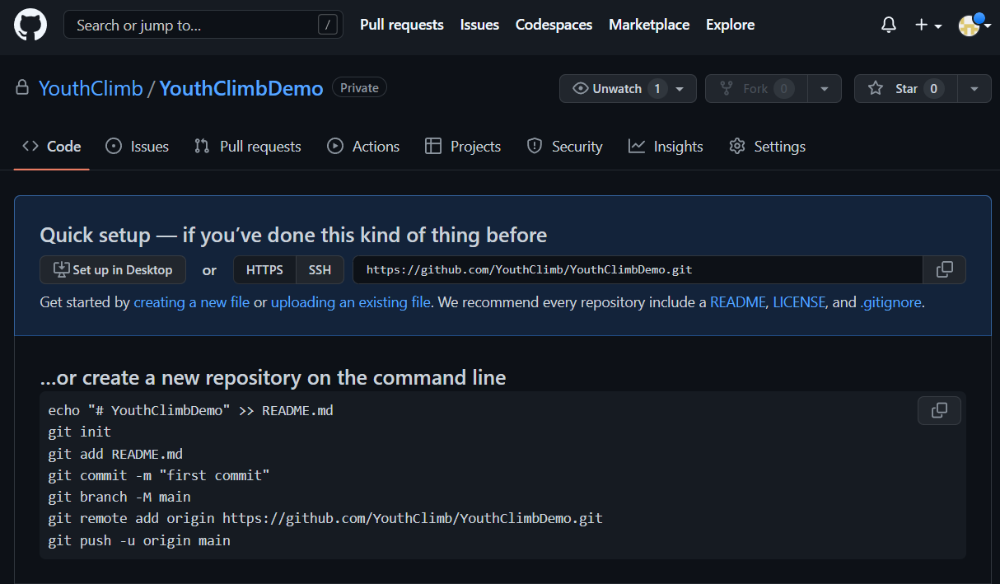
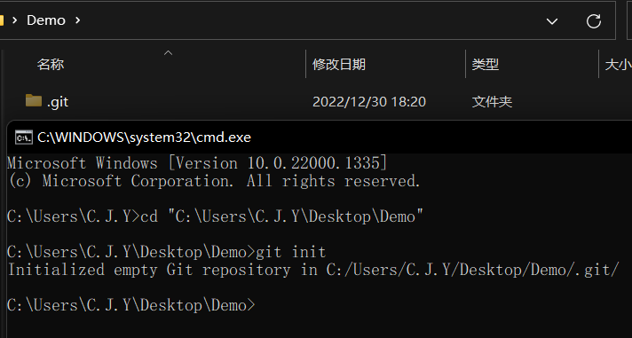
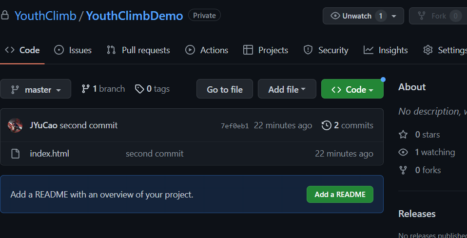
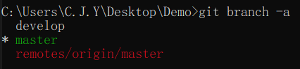
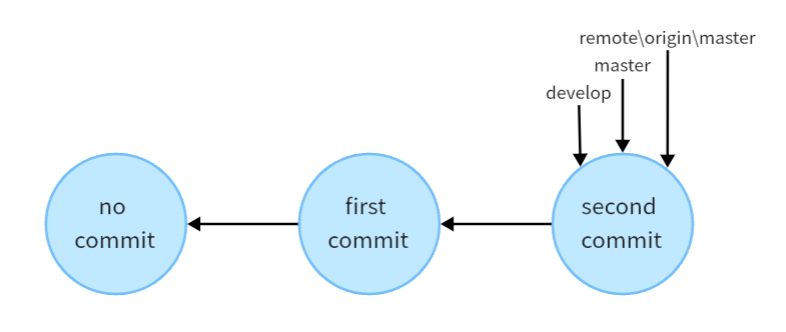
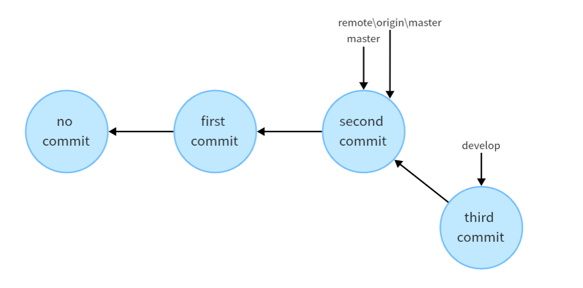
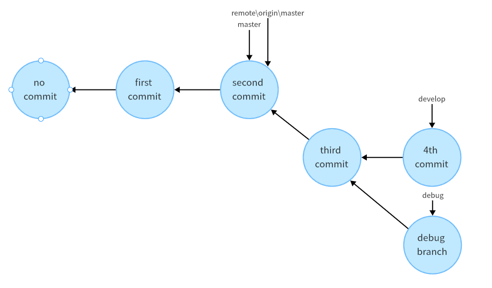
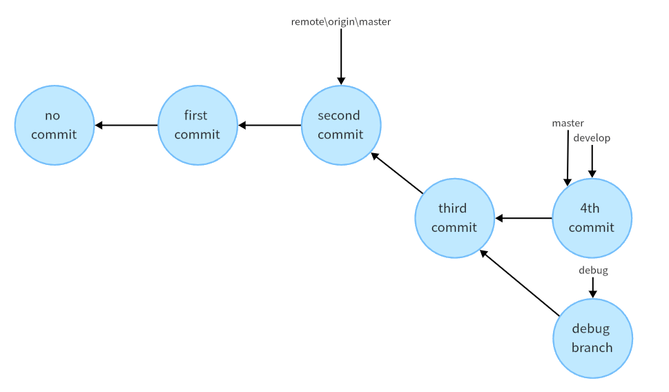

_Git_ 是一个工具。它能够记录项目中若干时期的快照，也能够从某一状态创建分支，和原路线实现并行开发。它能通过 _远程仓库_ 实现多个开发者合作——不同开发者负责不同的部分，最后进行合并。

## __介绍__
以下是 Git 的一些特性。

### __本地执行__
在 Git 中的绝大多数操作都不需要联网，它会将项目历史记录在本地磁盘，使操作得以瞬间完成。比如，你想要浏览项目的历史，Git不会外联到远程服务器读取再显示出来，它会直接从本地数据中读取。

这意味着你在离线或没有 VPN 时，几乎可以进行任何操作。如你在飞机或火车上想做些工作，就能愉快地提交（就像我现在这样=。=），直到有网络连接时再上传。如你回家后 VPN 客户端不正常，那么也仍能工作。

### __只添加数据__
你执行的 Git 操作，几乎只往 Git 数据库中 _添加_ 数据。 你很难使用Git从数据库中删除数据，也就是说Git几乎不会执行任何可能导致文件不可恢复的操作。

但是一旦你提交快照到 Git 中， 就难以再丢失数据，特别是如果你定期的推送数据库到其它仓库的话。这使得我们使用 Git 成为一个安心愉悦的过程，因为我们深知可以尽情做各种尝试，而没有把事情弄糟的危险。

### __文件的三种状态__
现在请注意，如果你希望后面的学习更顺利，请记住下面这些关于 Git 的概念。 Git 有三种状态，你的文件可能处于其中之一：_已提交（committed）_、_已修改（modified）_ 和 _已暂存（staged）_。


* 已修改表示修改了文件，但还没保存到数据库中。
* 已暂存表示对一个已修改文件的当前版本做了标记，使之包含在下次提交的快照中。
* 已提交表示数据已经安全地保存在本地数据库中。

基本的 Git 工作流程如下：
1. 在工作区中修改文件。
2. 将你想要下次提交的更改选择性地暂存，这样只会将更改的部分添加到暂存区。
3. 提交更新，找到暂存区的文件，将快照永久性存储到 Git 目录。

如果 Git 目录中保存着特定版本的文件，就属于 _已提交_ 状态。如果文件已修改并放入暂存区，就属于 _已暂存_ 状态。如果自上次检出后，作了修改但还没有放到暂存区域，就是 _已修改_ 状态。  

后续，你会进一步了解这些状态的细节，并学会如何根据文件状态实施后续操作，以及怎样跳过暂存直接提交。

## __安装__
参考[这篇文章](https://www.cnblogs.com/xueweisuoyong/p/11914045.html)，还有不了解的可以在[百度搜索“安装Git”](https://www.baidu.com/s?wd=git%E5%AE%89%E8%A3%85&rsv_spt=1&rsv_iqid=0xf3f475030007435a&issp=1&f=8&rsv_bp=1&rsv_idx=2&ie=utf-8&rqlang=cn&tn=baiduhome_pg&rsv_dl=tb&rsv_enter=1&oq=%25E5%25AE%2589%25E8%25A3%2585git&rsv_btype=t&inputT=3725&rsv_t=b3257yyYuyq8QTqO1tge9Z8OS8%2FK%2FlKvzVFpZM5OKeQbaXB0pdh3zwxhfMKEruB8XEqZ&rsv_sug3=9&rsv_sug1=5&rsv_sug7=100&rsv_pq=bbac17ff0008171b&rsv_sug2=0&rsv_sug4=4278)之类的关键字进行安装。

## __初次运行 Git 前的配置__
既然已经在系统上安装了 Git，你会想要做几件事来定制你的 Git 环境。 每台计算机上只需要配置一次，程序升级时会保留配置信息。 你可以在任何时候再次通过运行命令来修改它们。

你可以通过以下命令查看所有的配置以及它们所在的文件：
```
git config --list --show-origin
```

### __用户信息__
安装完 Git 之后，要做的第一件事就是设置你的用户名和邮件地址。 这一点很重要，因为每一个 Git 提交都会使用这些信息，它们会写入到你的每一次提交中，不可更改：
```
git config --global user.name "John Doe"
git config --global user.email johndoe@example.com
```

再次强调，如果使用了 `--global` 选项，那么该命令只需要运行一次，因为之后无论你在该系统上做任何事情， Git 都会使用那些信息。 当你想针对特定项目使用不同的用户名称与邮件地址时，可以在那个项目目录下运行没有 `--global` 选项的命令来配置。

### __文本编辑器__

既然用户信息已经设置完毕，你可以配置默认文本编辑器了，当 Git 需要你输入信息时会调用它。 如果未配置，Git 会使用操作系统默认的文本编辑器。
如果你想使用不同的文本编辑器，例如 Emacs，可以这样做：

```
git config --global core.editor emacs
```
在 Windows 上，如果你想要使用别的文本编辑器，那么必须指定可执行文件的完整路径。 它可能随你的编辑器的打包方式而不同。对于 Notepad++，你可能需要输入如下命令：
```
git config --global core.editor "'C:/Program Files/Notepad++/notepad++.exe' -multiInst -notabbar -nosession -noPlugin"
```

### __检查配置信息__
如果想要检查你的配置，可以使用 `git config --list` 命令来列出所有 Git 当时能找到的配置。

## __实践部分：Git 与 Github 的使用__
### __步骤一：Github 注册与仓库创建__
首先，打开 [Github](https://github.com/) ,点击右上角的 sign up（注册）。注册需要验证一个邮箱。

注册完成后，点击右上角的 New Repository 创建新的仓库。然后你会看到如下界面：



给你的仓库起一个名字（在这里我起名为 YouthClimbDemo ），描述是可选的。下面的 _私有_ 和 _公开_，选择公开的话其他人能够看到你的项目信息。在这里我选择私有。其他选项都可以不用管。点击最下方的创建，这样我们就创建了一个名为 YouthClimbDemo 的私人仓库,界面如下所示。



### __步骤二：Git 的使用__
在某处创建一个文件夹作为项目目录（存放源文件的目录），这里我在桌面创建了一个名为 Demo 的文件夹，它的路径为 `C:\Users\C.J.Y\Desktop\Demo`。

然后打开命令行，输入
```
cd "C:\Users\C.J.Y\Desktop\Demo"
```
跳转至项目目录。然后输入
```
git init
```
对目录进行初始化。此时，目录中创建了一个名为 .git 的隐藏子目录，这表示你的项目目录已经被 Git 初始化了。



然后你就可以开始写项目了，这里用一个简单的 html 文件作为演示。

在根目录创建一个名为 `index.html` 的文件，编辑它，在其中输入
(你可以copy一下)
```
<!DOCTYPE html>
<html lang="en">
<head>
    <meta charset="UTF-8">
    <meta http-equiv="X-UA-Compatible" content="IE=edge">
    <meta name="viewport" content="width=device-width, initial-scale=1.0">
    <title>Document</title>
</head>
<body>
    <p>Hello World</p>
</body>
</html>
```
它的效果是一个导航栏标题为Document，网页内容显示Hello World的网页。

这个时候你已经写完代码了，但在 Git 看来它是之前上文提到的未跟踪状态，你需要输入以下命令跟踪它。
```
git add index.html
```
它会变成已暂存的状态。

然后我们需要对它进行一次提交，这样 git 会记录下它的快照，将目录中各文件的状态永久记录下来。输入
```
git commit -m "first commit"
```
这样就提交成功了。顺带一提，每一次提交都需要提交者提供这次快照的描述。如果你仅仅是输入 `git commit` , git 会要求你提交详细的信息。如果加入参数 `-m` （就像上面那样），则只需要在双引号中输入简短的信息就可以了。

这些信息在多人合作开发中是至关重要的，它会告诉你的同伴们你在这次提交中做了哪些修改或者是遇到了哪些问题。所以写好 commit 的信息也是一门学问。详情可以参考这篇文章: [如何写好 commit message ](https://cbea.ms/git-commit/).

输入命令 `git log` 可以查看过去的提交日志，这里作为示例进行展示：
```
C:\Users\C.J.Y\Desktop\Demo>git log
commit ea15dd4f2cdfb98895a8fad24c1807551d70b2da (HEAD -> master)
Author: JYCao <caojiayu9@gmail.com>
Date:   Fri Dec 30 18:37:41 2022 +0800

    first commit

```
可以看到，在我输入 `git log` 后，显示出了第一次提交的信息，包括这一次提交的作者、邮箱、时间以及提交信息（节点这里先不解释，哈希值可以看相关资料）。

然后，假如我对于 Document 这一导航栏标题感到不满，把 Document 改成了 Hello 。这时，文件处于已修改的状态，必须要再一次进行 `git add`，然后提交。重复之前的步骤。

```
git add --all
git commit -m "second commit"
```

这样你就有两次提交了。

### __连接 Github 并上传__
在命令行中输入
```
git remote add origin https://github.com/YouthClimb/YouthClimbDemo.git
```

则可以连接至 Github 上的远程仓库。这里的网址是你的仓库的网址。输入 `git remote -v` 可以查看状态，这里是示例。示例上显示已经连接成功。
```
C:\Users\C.J.Y\Desktop\Demo>git remote -v
origin  https://github.com/YouthClimb/YouthClimbDemo.git (fetch)
origin  https://github.com/YouthClimb/YouthClimbDemo.git (push)
```

然后输入
```
git push --set-stream origin master
```
将本地目录上传至远程 Github 仓库。现在已经不用怕文件损坏或者丢失了。以下是上传成功的示例。
```
C:\Users\C.J.Y\Desktop\Demo>git push --set-upstream origin master
Enumerating objects: 6, done.
Counting objects: 100% (6/6), done.
Delta compression using up to 16 threads
Compressing objects: 100% (4/4), done.
Writing objects: 100% (6/6), 634 bytes | 211.00 KiB/s, done.
Total 6 (delta 1), reused 0 (delta 0), pack-reused 0
remote: Resolving deltas: 100% (1/1), done.
To https://github.com/YouthClimb/YouthClimbDemo.git
 * [new branch]      master -> master
Branch 'master' set up to track remote branch 'master' from 'origin'.
```
现在刷新网页，你会看到你的 Github 仓库变成了这样。



有一个index.html文件，并且有两次提交记录。这样，你的第一次 Github 上传就完成了。

## __关于分支与合并，以及其他操作__
在 Git 开发中，是存在分支的。在上述教程中，你们也许注意到了多次出现的 `master` 一词，这是 Git 的默认分支，初始名字叫 master。

举个例子，比如你和其他人开发某个项目，假如两个人同时进行了 `git pull` (用于从远程仓库更新本地目录)，然后命名了不同分支，编辑提交后进行`git push`，这样远程仓库就产生了多个目录结构不同的支路。

在实际开发中，常常创建另外一个分支（通常命名为 develop ），用于存放当前正在开发的不稳定版本，而 master 主分支则用于存放已经稳定的版本，在develop稳定后可以将其合并到 master 上。如果遇到了其他问题，则可以创建另外的次要分支用于解决它们，解决后再合并到主要分支上。

现在使用之前的例子演示分支与合并。

在命令行中输入
```
git branch develop
```
这条语句的作用是创建一个新的分支，名为 develop。如图，可以看到现在有三个分支存在。



为什么是三个分支呢？其中带有前缀 `remotes/origin/` 的分支为远端服务器仓库上的分支，绿色前面带有星号的是现在所在的分支，而 `develop` 是刚刚创建的新分支。下面是目前的分支状态。



我们现在稍微改变一下目录状态，修改 index.html 文件，进行第三次提交。由于我们是在 develop 上，所以状态变成了这样。



这时，如果我们在继续开发的过程中遇到了问题，可以重复上述命令创建一个新的分支用于 debug ，如果还未等 debug 完成，如果 develop 又进行了一次新的提交，就会出现这样的情况。



此时，如果觉得第四次提交的版本足够稳定，可以将其合并到 master 主分支上。用下述代码先切换到主分支，再合并到develop上。
```
git checkout master
git merge develop
```



最终 debug 完成后，可以将 debug 合并到主分支上，然后进行对远程仓库进行提交。这种情况的合并是最常规的合并，可能会遇到冲突问题。具体操作不再赘述，可以看该仓库中上传的《Progit》进行学习，或是遇到问题时再去查资料解决。

关于其他的 Git 操作，可以用到时再查，不过推荐花一点时间看看《Progit》更好。由于本人水平有限，教程只能写到这里告一段落了。