很多朋友在使用电脑过程中，可能会遇到系统崩溃、性能下降或者需要升级系统等情况，这时候重装操作系统成为一种常见的解决方案。然而，对于一些不熟悉电脑操作的用户来说，重装系统可能会显得复杂和困难。因此，本文将提供一个详细的步骤指南，帮助用户正确地重装操作系统。

## **准备工作**

本文以Windows操作系统为例，介绍如何正确重装系统。首先，我们需要准备以下工具和材料：
1. **一个可启动的USB驱动器**：你需要一个至少8GB容量的USB驱动器，用于创建安装介质。
2. **Windows安装镜像**：你可以从微软官方网站下载 Windows 安装镜像（ISO文件）。
3. **备份重要数据**：重装系统会清除**C盘**所有数据，因此请确保你已经备份了所有重要的文件和数据到外部存储
4. **电脑型号对应的驱动程序**：在重装系统后，你可能需要安装一些特定的驱动程序（特别是网卡驱动）。建议提前下载并保存这些驱动程序，以便在重装系统后能够尽快联网。

## **创建系统安装介质**

第一步，我们需要创建一个可启动的USB驱动器来安装Windows系统。本质上，这个USB驱动器就像一个安装盘，可以引导电脑进入安装界面，最终将操作系统写入硬盘。

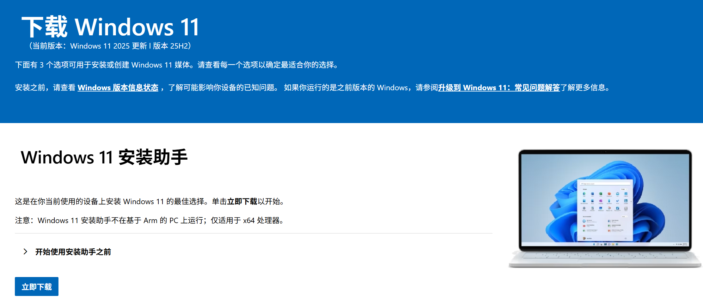

创建安装介质的过程并不复杂。首先去微软官方网站下载存储介质创建工具（Media Creation Tool），点击[此处](https://www.microsoft.com/zh-cn/software-download/windows11)进入下载页面，然后选择下图的选项。

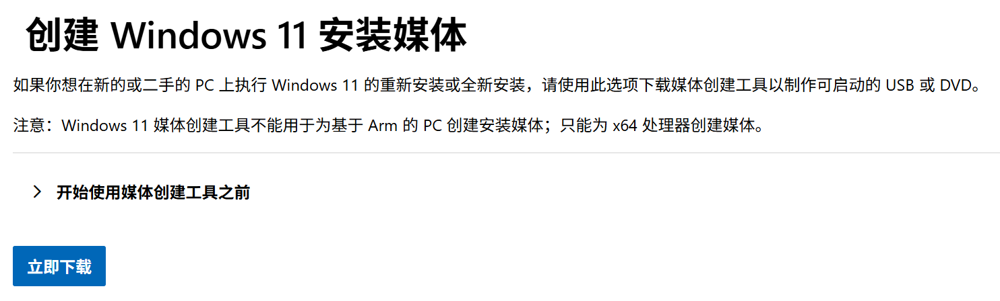

下载完成后，**插入 USB 驱动器**并运行该工具。

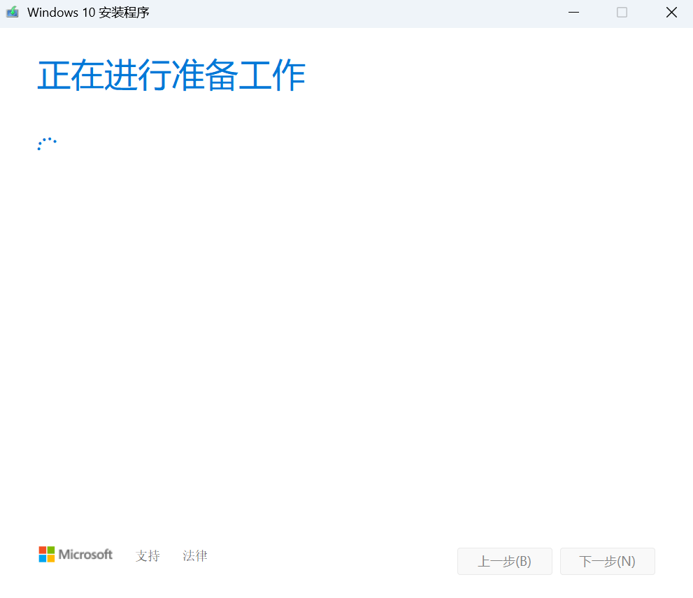

等待一段时间后，按照提示选择语言、版本和体系结构（32位或64位），可以直接使用推荐。

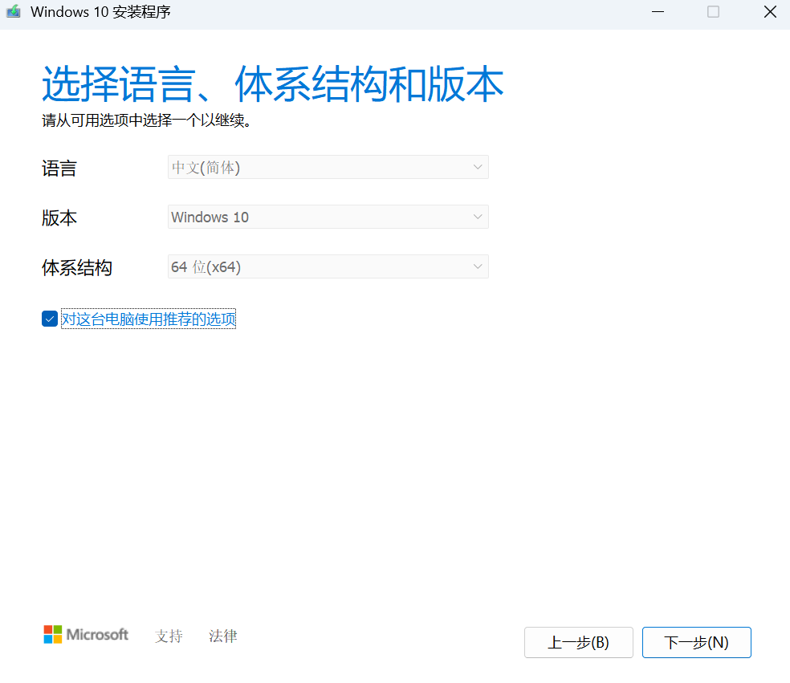

然后选择“为另一台电脑创建安装介质”。

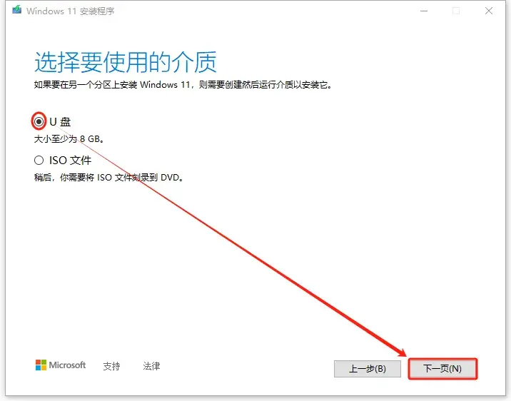

接下来，选择“U盘”作为安装介质，并选择你插入的USB驱动器。工具会自动下载所需的文件并将其写入USB驱动器，完成后你就有了一个可启动的安装介质。

## **下载驱动程序**

一般情况下，Windows安装完成后会自动安装大部分驱动程序，但有时候可能会缺少一些特定的驱动程序，特别是网卡驱动，这会导致无法联网。因此，在重装系统之前，建议提前下载并保存你电脑型号对应的驱动程序，尤其是网卡驱动。

通常，你可以访问电脑制造商的官方网站，输入你的电脑型号，找到对应的驱动程序下载页面，然后下载并保存这些驱动程序到外部存储设备（如USB驱动器）。这样，在重装系统后，你就可以直接安装这些驱动程序，确保电脑能够正常联网和使用。

## **磁盘分区**

有些朋友重装系统可能想要将分区合并，或者将合并分区重新分开来使用。对于这些操作，建议使用第三方分区工具，如 [DiskGenius](https://www.diskgenius.cn/download.php) 等。这些工具提供了更丰富的功能，可以帮助你更灵活地管理磁盘分区。

需要注意的是，合并分区会清楚除被合并分区中的所有数据，因此在进行分区操作之前，请务必备份重要数据。

另外，在系统安装过程中，Windows安装程序也提供了基本的分区管理功能，你也可以不使用第三方工具，在安装过程中选择自定义安装，然后对磁盘进行分区和格式化操作。

拆分分区和合并分区可以参考 DiskGenius 的官方教程：

- [DiskGenius 在线帮助 - 拆分分区](https://www.diskgenius.cn/help/partspliting.php)
- [DiskGenius 在线帮助 - 合并分区](https://www.diskgenius.cn/help/add-free-space-to-partition.php)

> 合并分区前，需要对被合并分区（不是所有分区都要格式化，是被合并的分区！！）进行格式化，清除其中的所有数据。请务必备份重要数据后再进行操作。
> 
> **注意：** 在进行分区操作时，请务必小心，确保你知道自己在做什么，以免误操作导致数据丢失。

## **安装系统**

完成上述准备工作后，你就可以开始安装系统了。首先，**插入可启动的USB驱动器**，然后重启电脑。在启动过程中，按下相应的键（通常是F1、F2、F5、F12、Delete等，具体取决于你的电脑型号）进入 BIOS 设置界面。

在 BIOS 设置中，找到启动选项（Boot Options），将 USB 驱动器设置为第一启动项。保存设置并退出 BIOS，电脑会从 USB 驱动器启动，进入 Windows 安装界面。

成功从U盘启动后，你会看到如下界面：

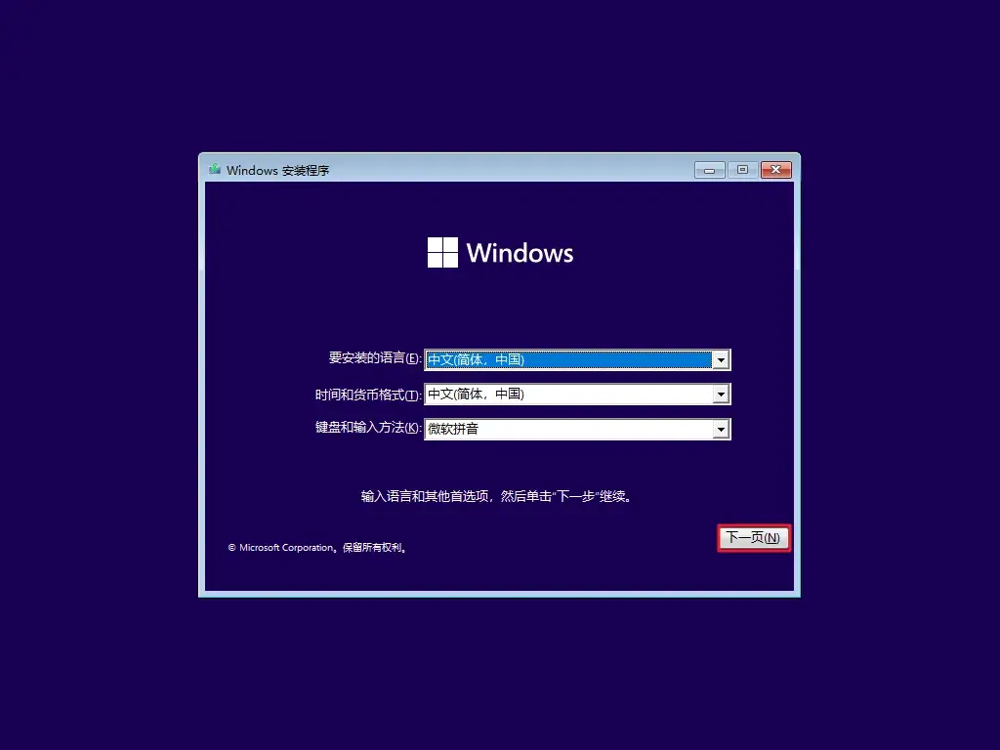

点击下一步，选择现在安装。

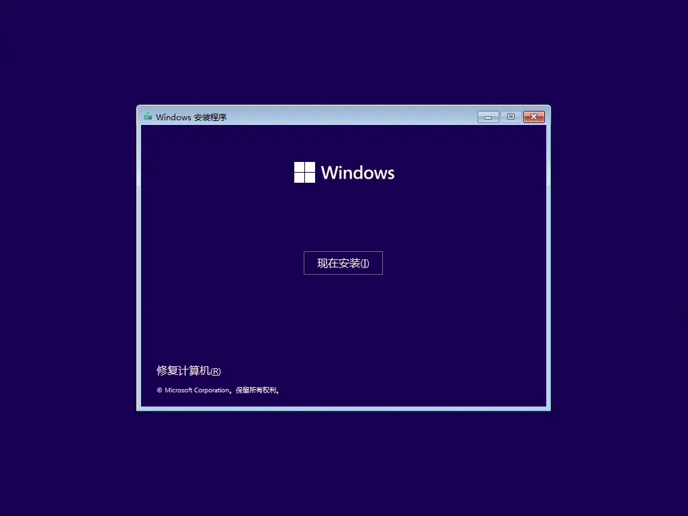

等待安装程序启动，然后看到这个界面，先选择没有密钥，因为之后会使用 Office Tool Plus 进行激活。

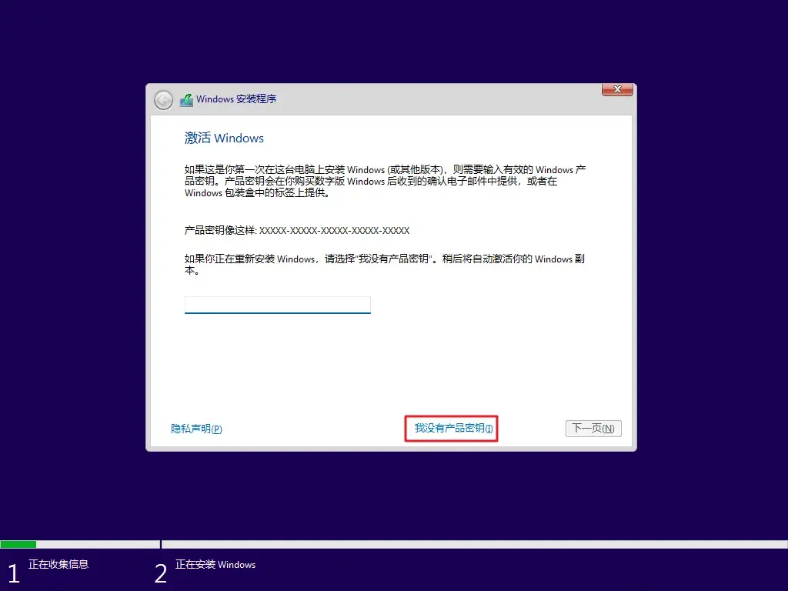

选择你要的安装类型，点击下一页。

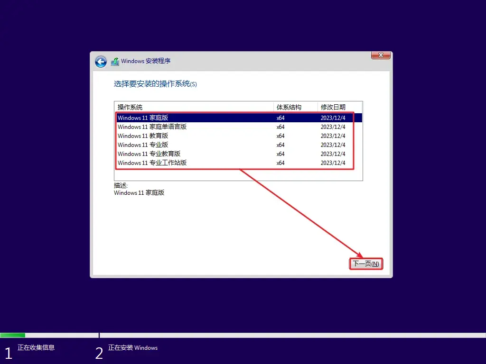

后续勾选接受软件许可证条款，点击下一页。然后在这个页面点击自定义安装。

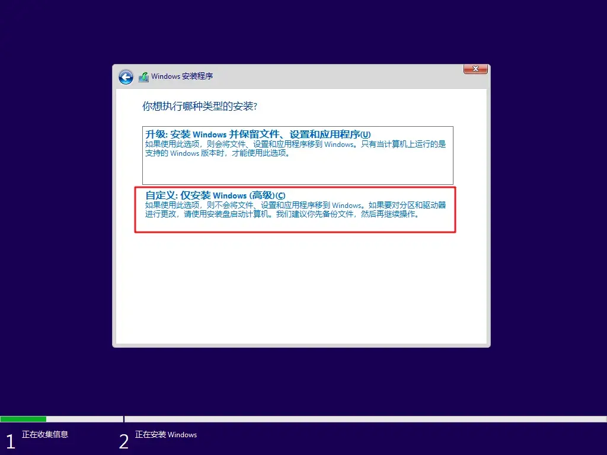

这里分两种情况进行操作，如果只是想在C盘重装系统，直接选中C盘选择删除即可。然后选择新出现的未分配空间点击下一页即可。下图中前四个是 C 盘所在的分区，删除后它们会合成一个大的未分配空间。

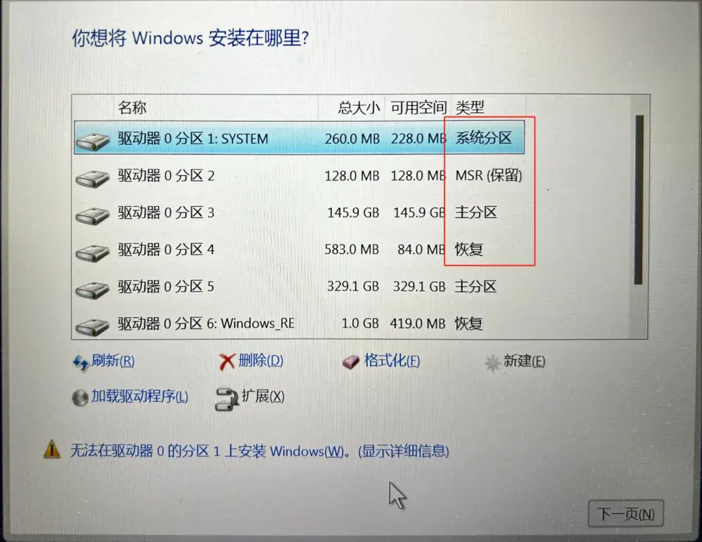

还有种情况是，你电脑里所有文件都不需要了，那么你可以删除所有能删除的分区，不能删除的分区删除按钮会显示灰色。

如果你电脑只有一块硬盘，全部删除后它们最终会合成一个大的未分配空间，直接选中这个未分配空间点击下一页。接下来什么都不用做，等待安装完成即可。

安装完成后，会提示需要重启，可以点击【立即重启】或者读秒后自动重启，重启后U盘就可以拔掉了，到这里系统已经算是正式安装完成。

## **安装后的基础配置**

安装完成后，你可能需要进行一些基础配置。这里给一些必要的建议：

###  **安装驱动程序**

如果系统无法联网，首先安装你之前下载的网卡驱动程序，确保电脑能够联网。

然后可以通过 Windows 更新或者设备管理器安装其他缺失的驱动程序。

> 建议下载一个解压软件（如 WinRAR、**7-Zip** 等），以便解压下载的驱动程序文件以及后续软件。

### **激活系统**

激活刚安装的操作系统，以及新安装并激活 Office 可以使用一些第三方工具进行激活和安装。

激活 Windows 我推荐使用 [HEU_KMS_Activator](https://github.com/zbezj/HEU_KMS_Activator/releases)。

> 由于此处引用的是 Github 页面，可能无法直接访问，如果无法访问，可以使用科学上网工具访问，或者在浏览器搜索“HEU_KMS_Activator”找到其他下载链接进行下载。

具体使用方法可参考[此处](https://zhuanlan.zhihu.com/p/683533035)。

### **安装 Office 全家桶**

安装并激活 Office 全家桶（包括 Word、Excel、PowerPoint、OneNote、Visio 等）也是非常必要的。

这里推荐使用 [Office Tool Plus（点击此处前往下载页面）](https://www.officetool.plus/zh-cn/introduction/download.html)进行安装和激活。建议在下载页面选择使用于 Windows x86 平台的版本进行下载。

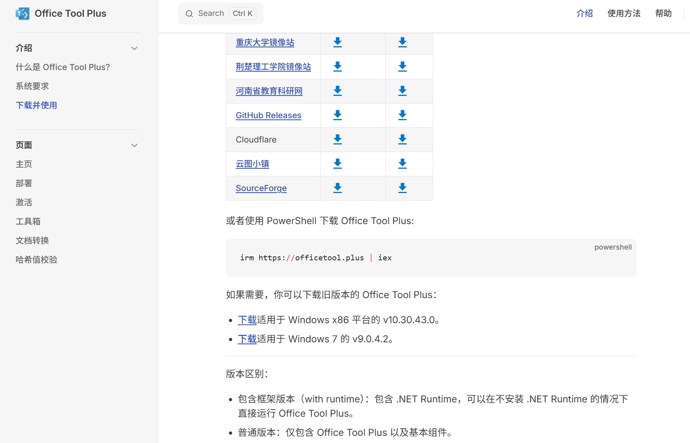

Office Tool Plus 的使用方式可以参考[此处](https://zhuanlan.zhihu.com/p/671033717)。

### **其他软件安装**

接下来你可以根据自己的需要安装其他软件，如浏览器、聊天工具、开发工具等。建议从官方网站下载软件，以确保安全和稳定。

## 参考
1. [下载 Windows 11: ](https://www.microsoft.com/zh-cn/software-download/windows11)https://www.microsoft.com/zh-cn/software-download/windows11

2. [DiskGenius 官方下载页面: ](https://www.diskgenius.cn/download.php)https://www.diskgenius.cn/download.php

3. [DiskGenius 在线帮助 - 拆分分区: ](https://www.diskgenius.cn/help/partspliting.php)https://www.diskgenius.cn/help/partspliting.php

4. [DiskGenius 在线帮助 - 合并分区: ](https://www.diskgenius.cn/help/add-free-space-to-partition.php)https://www.diskgenius.cn/help/add-free-space-to-partition.php

5. [最详细最官方的 Windows 11 安装教程: ](https://www.microsoft.com/zh-cn/software-download/windows11)https://www.microsoft.com/zh-cn/software-download/windows11

6. [Office Tool Plus 官方下载页面: ](https://www.officetool.plus/zh-cn/introduction/download.html)https://www.officetool.plus/zh-cn/introduction/download.html

7. [HEU_KMS_Activator GitHub 页面: ](https://github.com/zbezj/HEU_KMS_Activator/releases)https://github.com/zbezj/HEU_KMS_Activator/releases

8. [HEU_KMS_Activator 使用教程: ](https://zhuanlan.zhihu.com/p/683533035)https://zhuanlan.zhihu.com/p/683533035

9. [Office Tool Plus 使用教程: ](https://zhuanlan.zhihu.com/p/671033717)https://zhuanlan.zhihu.com/p/671033717
